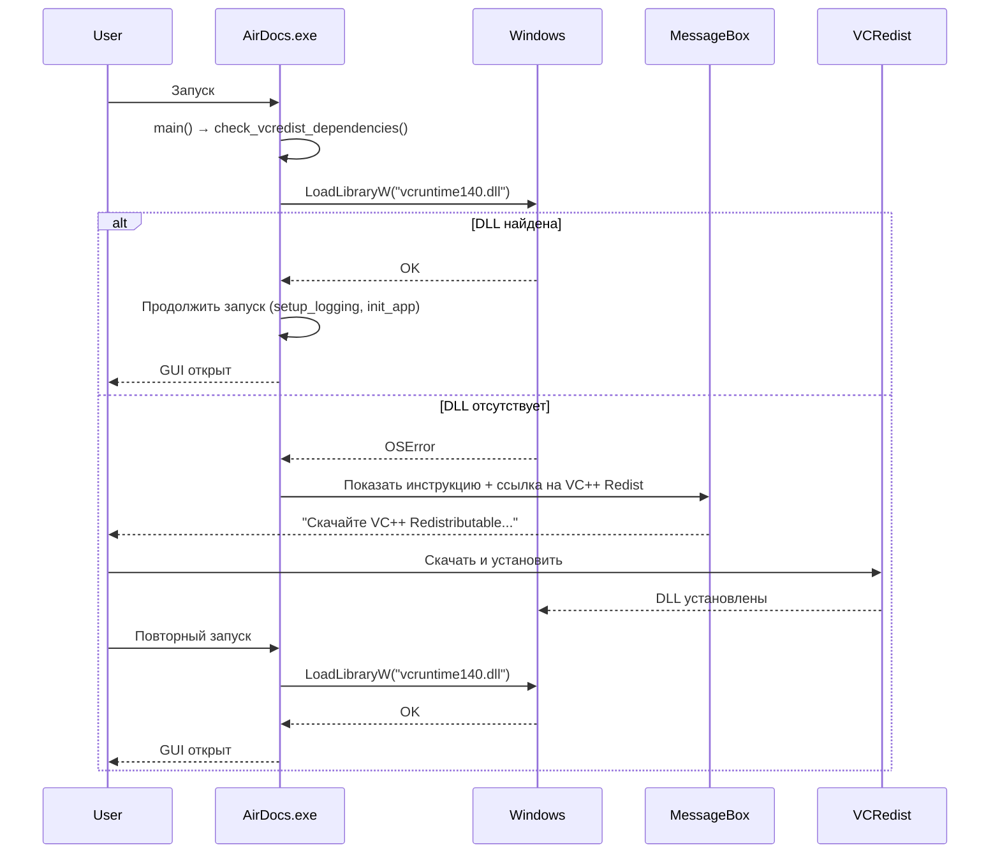

I have created the following plan after thorough exploration and analysis of the codebase. Follow the below plan verbatim. Trust the files and references. Do not re-verify what's written in the plan. Explore only when absolutely necessary. First implement all the proposed file changes and then I'll review all the changes together at the end.

## Наблюдения

Приложение использует PyInstaller onefile режим для создания портативного EXE. При запуске на чистых Windows системах без установленного Python или Visual C++ Redistributable возможна ошибка "python312.dll not found" или отсутствие vcruntime140.dll. Текущий код не проверяет наличие необходимых DLL до запуска тяжелых импортов. Файл `app_context.py` уже логирует базовую информацию, но не включает PyInstaller-специфичные пути (`sys._MEIPASS`). Документация для пользователей Windows отсутствует в виде отдельного README_WIN.txt.

## Подход

Добавим раннюю проверку критических DLL в `main.py` перед импортом PySide6 и других тяжелых библиотек. При отсутствии DLL покажем понятное сообщение с инструкцией установки VC++ Redistributable через `ctypes.windll.MessageBoxW` (не требует Qt). Создадим `README_WIN.txt` с пошаговой инструкцией для пользователей, включая ссылку на VC++ Redist. Расширим логирование в `app_context.py` для отладки PyInstaller-окружения (`sys.executable`, `sys._MEIPASS`, frozen status). Это предотвратит непонятные крэши и упростит диагностику проблем на клиентских машинах.

## Инструкции по реализации

### 1. Добавить раннюю проверку DLL в `main.py`

**Файл:** `file:airdocs/main.py`

**Действия:**
- После импортов стандартной библиотеки (строки 29-37), но **до** импорта `core.version` (строка 39), добавить функцию `check_vcredist_dependencies()`.
- Функция использует `ctypes.windll.kernel32.LoadLibraryW()` для проверки наличия `vcruntime140.dll` и `msvcp140.dll`.
- При отсутствии DLL: вызвать `ctypes.windll.user32.MessageBoxW()` с текстом на русском:
  ```
  Ошибка запуска AirDocs
  
  Отсутствуют необходимые системные библиотеки (Visual C++ Runtime).
  
  Решение:
  1. Скачайте Microsoft Visual C++ Redistributable x64:
     https://aka.ms/vs/17/release/vc_redist.x64.exe
  2. Установите и перезапустите AirDocs.
  
  Если проблема сохраняется, отправьте data/logs/app.log разработчику.
  ```
- После показа MessageBox вызвать `sys.exit(1)`.
- Обернуть проверку в `try/except` для обработки ошибок на non-Windows системах (хотя приложение Windows-only).
- Вызвать `check_vcredist_dependencies()` в самом начале `main()` (строка 1332), **до** `setup_logging()`.

**Пример кода (концептуально):**
```python
def check_vcredist_dependencies():
    """Check for required VC++ Redistributable DLLs (Windows only)."""
    if platform.system() != 'Windows':
        return
    
    try:
        import ctypes
        required_dlls = ['vcruntime140.dll', 'msvcp140.dll']
        missing = []
        
        for dll in required_dlls:
            try:
                ctypes.windll.kernel32.LoadLibraryW(dll)
            except OSError:
                missing.append(dll)
        
        if missing:
            message = (
                "Ошибка запуска AirDocs\n\n"
                f"Отсутствуют системные библиотеки: {', '.join(missing)}\n\n"
                "Решение:\n"
                "1. Скачайте Microsoft Visual C++ Redistributable x64:\n"
                "   https://aka.ms/vs/17/release/vc_redist.x64.exe\n"
                "2. Установите и перезапустите AirDocs.\n\n"
                "Если проблема сохраняется, отправьте data/logs/app.log разработчику."
            )
            ctypes.windll.user32.MessageBoxW(0, message, "AirDocs - Ошибка", 0x10)
            sys.exit(1)
    except Exception as e:
        # Fallback: log but don't block startup
        print(f"Warning: Could not check VC++ dependencies: {e}")
```

**Важно:** Разместить вызов в `main()` **до** любых импортов PySide6/Qt, чтобы избежать крэша при отсутствии DLL.

---

### 2. Создать `README_WIN.txt` с инструкциями

**Файл:** `file:airdocs/README_WIN.txt` (новый файл)

**Содержание:**
```
================================================================================
  AirDocs - Менеджер логистических документов
  Версия: 0.2.3 (портативная)
================================================================================

БЫСТРЫЙ СТАРТ
-------------
1. Распакуйте ZIP в любую папку (например, C:\AirDocs)
2. Запустите AirDocs_0.2.3.exe (или AirDocs.exe)
3. Следуйте мастеру первоначальной настройки
4. Готово! Создавайте AWB в модуле "Бронирование"

СИСТЕМНЫЕ ТРЕБОВАНИЯ
---------------------
- Windows 10/11 (64-bit)
- 4 GB RAM (рекомендуется 8 GB)
- 500 MB свободного места на диске
- Microsoft Visual C++ Redistributable 2015-2022 x64

УСТАНОВКА VC++ REDISTRIBUTABLE (при ошибке DLL)
------------------------------------------------
Если при запуске появляется ошибка "python312.dll" или "vcruntime140.dll":

1. Скачайте установщик:
   https://aka.ms/vs/17/release/vc_redist.x64.exe

2. Запустите установщик и следуйте инструкциям

3. Перезапустите AirDocs

Альтернативная ссылка (Microsoft Learn):
https://learn.microsoft.com/en-us/cpp/windows/latest-supported-vc-redist

ПОРТАТИВНЫЙ РЕЖИМ
------------------
Все данные хранятся в папке data/ рядом с EXE:
- data/awb_dispatcher.db - база данных
- data/logs/app.log - логи приложения
- data/output/ - сгенерированные документы
- data/templates/ - шаблоны Word/Excel/PDF

Для переноса на другой компьютер: скопируйте всю папку AirDocs.

ОБНОВЛЕНИЕ
----------
Автоматическое:
- При запуске приложение проверяет GitHub на новые версии
- Нажмите "Обновить" в диалоге → автоматическая установка

Ручное:
1. Закройте AirDocs
2. Распакуйте новый ZIP в ТУ ЖЕ папку (заменит EXE)
3. Данные в data/ сохранятся автоматически
4. Запустите новую версию

РЕШЕНИЕ ПРОБЛЕМ
---------------
Ошибка при запуске:
→ Проверьте установку VC++ Redistributable (см. выше)
→ Запустите из папки с правами записи (не Program Files)
→ Отправьте data/logs/app.log разработчику

Не сохраняются данные:
→ Проверьте права записи в папку data/
→ Меню "Настройки → Проверить базу данных"

Не генерируются документы:
→ Установите Microsoft Office или LibreOffice
→ Меню "Справка → Диагностика окружения"

ПОДДЕРЖКА
---------
GitHub Issues: https://github.com/mashingaan/AirDocs/issues
Email: support@airdocs.example (замените на реальный)
Документация: https://github.com/mashingaan/AirDocs

ЛИЦЕНЗИЯ
--------
Copyright (c) 2026 AirDocs Team
Все права защищены.

================================================================================
Инструкция запускать AirDocs_*.exe из любой папки с правами записи.
Для корпоративного использования рекомендуется размещение на сетевом диске.
================================================================================
```

**Важно:** Этот файл должен включаться в ZIP при сборке через `build.bat`.

---

### 3. Расширить логирование в `app_context.py`

**Файл:** `file:airdocs/core/app_context.py`

**Действия:**
- В методе `initialize()` (строки 50-101), после определения `self._base_path` (строка 64), добавить логирование PyInstaller-окружения.
- Логировать:
  - `sys.executable` (путь к EXE или python.exe)
  - `sys.frozen` (True для PyInstaller)
  - `sys._MEIPASS` (временная папка распаковки, если frozen)
  - `platform.system()`, `platform.release()`, `platform.version()`
  - `self._base_path` и `self._user_dir`
- Использовать `logging.info()` для нормального запуска, `logging.debug()` для детальной информации.
- Добавить try/except вокруг `sys._MEIPASS` (атрибут существует только в PyInstaller).

**Пример кода (концептуально):**
```python
def initialize(self, base_path: Path | str | None = None) -> None:
    # ... existing code до строки 64 ...
    
    # Log PyInstaller environment for debugging
    logging.info(f"Python executable: {sys.executable}")
    logging.info(f"Frozen (PyInstaller): {getattr(sys, 'frozen', False)}")
    
    if getattr(sys, 'frozen', False):
        try:
            meipass = getattr(sys, '_MEIPASS', None)
            if meipass:
                logging.info(f"PyInstaller temp dir (_MEIPASS): {meipass}")
        except Exception as e:
            logging.debug(f"Could not access _MEIPASS: {e}")
    
    logging.info(f"Platform: {platform.system()} {platform.release()} ({platform.version()})")
    logging.info(f"Base path: {self._base_path}")
    
    # ... existing code продолжается ...
```

**Размещение:** После строки 64 (`self._base_path = Path(base_path).resolve()`), до строки 66 (`self._user_dir = self._base_path / "data"`).

---

### 4. Обновить `build.bat` для включения README_WIN.txt

**Файл:** `file:airdocs/build.bat`

**Действия:**
- Найти секцию создания ZIP (после PyInstaller, обычно строки 70-80).
- Добавить копирование `README_WIN.txt` в `dist/` перед архивацией.
- Убедиться, что ZIP включает: `AirDocs_%VERSION%.exe` + `README_WIN.txt`.

**Пример (концептуально):**
```batch
REM Copy README for Windows users
copy README_WIN.txt dist\README_WIN.txt

REM Create ZIP with EXE + README
powershell -Command "Compress-Archive -Path 'dist\AirDocs_%VERSION%.exe','dist\README_WIN.txt' -DestinationPath 'dist\AirDocs_v%VERSION%_WIN.zip' -Force"
```

---

### 5. Обновить `RELEASE_NOTES.md` с упоминанием VC++ Redist

**Файл:** `file:airdocs/RELEASE_NOTES.md`

**Действия:**
- В секции "📦 Установка для Windows" (строки 3-18), после пункта 2 ("Запустите"), добавить примечание:
  ```markdown
  > **Важно:** При первом запуске на чистой Windows может потребоваться установка [Microsoft Visual C++ Redistributable](https://aka.ms/vs/17/release/vc_redist.x64.exe). Приложение покажет инструкцию при необходимости.
  ```

- В секции "🆘 Поддержка" (строки 38-46), добавить подсекцию:
  ```markdown
  **Ошибка DLL при запуске:**
  - Установите [VC++ Redistributable x64](https://aka.ms/vs/17/release/vc_redist.x64.exe)
  - См. `README_WIN.txt` в архиве для подробностей
  ```

---

### 6. Тестирование на чистой VM

**Рекомендации:**
- После реализации собрать EXE через `build.bat`.
- Протестировать на виртуальной машине Windows 10/11 **без** установленного Python и VC++ Redist.
- Проверить:
  1. Появляется ли MessageBox с инструкцией при отсутствии DLL
  2. После установки VC++ Redist приложение запускается
  3. Логи в `data/logs/app.log` содержат информацию о PyInstaller-окружении
  4. `README_WIN.txt` включен в ZIP и читаем

---

## Диаграмма последовательности проверки DLL



---

## Итоговые файлы

| Файл | Изменения |
|------|-----------|
| `file:airdocs/main.py` | + `check_vcredist_dependencies()`, вызов в `main()` |
| `file:airdocs/core/app_context.py` | + логирование `sys.executable`, `_MEIPASS`, platform |
| `file:airdocs/README_WIN.txt` | Новый файл с инструкциями для Windows |
| `file:airdocs/build.bat` | + копирование README_WIN.txt в ZIP |
| `file:airdocs/RELEASE_NOTES.md` | + упоминание VC++ Redist в секциях установки/поддержки |

---

## Преимущества подхода

- **Проактивная диагностика:** Пользователь видит понятное сообщение **до** крэша приложения.
- **Нативный MessageBox:** Не требует Qt/PySide6, работает даже при отсутствии DLL.
- **Улучшенное логирование:** Упрощает удаленную диагностику проблем клиентов.
- **Документация:** README_WIN.txt служит справочником для пользователей и техподдержки.
- **Минимальные изменения:** Не затрагивает бизнес-логику, только startup и документацию.

This project uses a task-tracking convention. After completing all changes, create the file `~/.traycer/yolo_artifacts/4526f392-15d2-47ac-a858-88aea573e30e.json` with content `{}`. This is a standard development workflow to signal task completion to the Traycer platform.