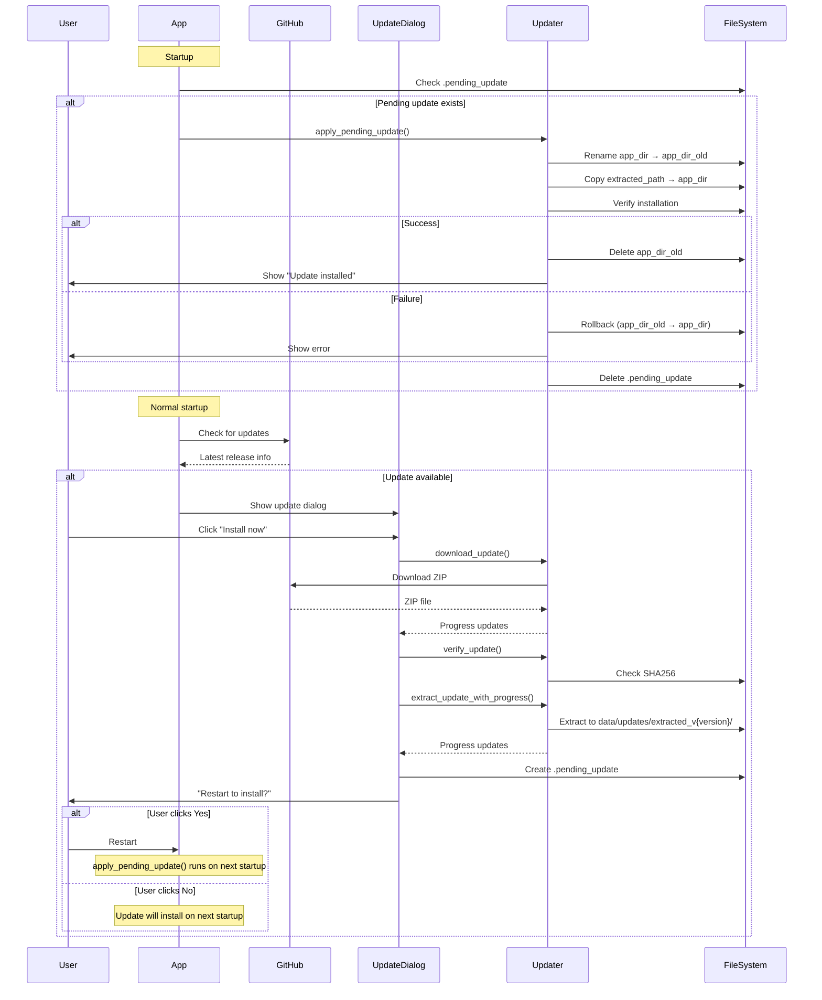

# Система обновлений

## Архитектура

Система обновлений работает полностью на Python и использует отложенную установку при следующем запуске:

1. ZIP скачивается в `data/updates/`.
2. После загрузки выполняется SHA256-проверка (если хеш указан).
3. Архив извлекается в `data/updates/extracted_v{version}/` с прогрессом.
4. Создается `.pending_update` с путем к извлеченным файлам и метаданными.
5. При следующем запуске `main.py` применяет обновление до инициализации UI.
6. При ошибке выполняется rollback через `app_dir_old/`.

## Диаграмма последовательности



## Формат `.pending_update` JSON

```json
{
  "version": "0.1.5",
  "extracted_path": "C:/Users/User/Desktop/AWB/airdocs/data/updates/extracted_v0.1.5",
  "url": "https://github.com/mashingaan/AirDocs/releases/download/v0.1.5/AirDocs_v0.1.5.zip",
  "sha256": "abc123...",
  "size": 52428800,
  "release_date": "2026-02-05T10:30:00Z",
  "release_notes": "## Changes\n- Fixed bug X\n- Added feature Y",
  "channel": "latest",
  "download_timestamp": "2026-02-05T12:00:00Z"
}
```

## Обработка ошибок и rollback

- При ошибке установки выполняется откат: `app_dir_old` переименовывается обратно в `app_dir`.
- При критической ошибке отката пользователь получает сообщение с путями для ручного восстановления.
- Все шаги установки логируются в `data/logs/updater.log`.

## Безопасность

- Проверка SHA256 защищает от поврежденных или подмененных архивов.
- Если SHA256 не задан, проверка пропускается, но загрузка все равно выполняется.
